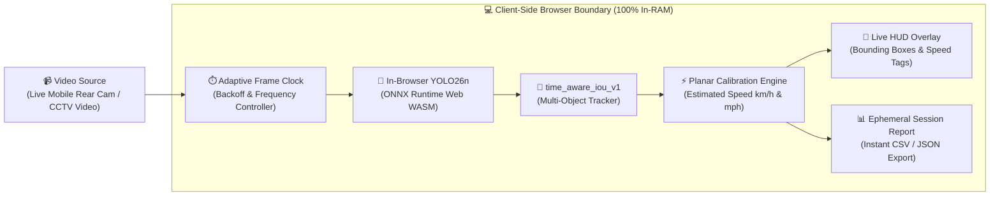

# RoadLens AI 🚗⚡

<div align="center">

# 🚦 Next-Gen In-Browser Traffic Intelligence

**Transform any smartphone, laptop webcam, or CCTV footage into an autonomous edge-AI traffic camera — running 100% locally via WebAssembly and YOLO.**

<br />

[](https://roadlens-ai-lime.vercel.app)
[](https://roadlens-ai-lime.vercel.app/camera)
[](https://github.com/ajinkyachalke008/Roadlens-AI)
[](https://react.dev)
[](https://www.typescriptlang.org)
[](https://vitejs.dev)
[](https://onnxruntime.ai/)
[](LICENSE)

<br />

[🌐 **Open Live App**](https://roadlens-ai-lime.vercel.app) · [📷 **Open Live Camera**](https://roadlens-ai-lime.vercel.app/camera) · [📱 **Mobile Instructions**](#-mobile-quickstart) · [🛠️ **Local Setup**](#-local-development-quickstart) · [🏗️ **Architecture**](#-real-time-architecture-pipeline) · [📖 **Docs**](docs/)

</div>

---

## ⚡ At a Glance: Key Impact Metrics

<div align="center">

| 🚀 0ms Cloud Latency | 🔒 100% Private (RAM Only) | 🚗 6 Detection Classes | 📉 $0 Server Inference Cost |
| :---: | :---: | :---: | :---: |
| Runs directly on-device via WebAssembly | Zero telemetry, cookies, or databases | Cars, Trucks, Buses, Bikes, Motos, People | No expensive cloud GPUs or subscriptions |

</div>

---

## 📖 About RoadLens AI

**RoadLens AI** is an open-source, client-side computer vision system engineered to make urban and neighborhood traffic observation accessible to everyone. 

Traditional CCTV and traffic analytics platforms require costly specialized hardware, proprietary RTSP cloud encoders, and expensive monthly cloud GPU bills. Moreover, streaming 24/7 public video across the internet presents major privacy risks.

**RoadLens AI flips this model completely:**
1. **Edge-First Neural Network Execution**: Machine learning inference (YOLO26n FP32) executes locally inside your web browser via **ONNX Runtime Web** and single-thread WebAssembly (WASM).
2. **True Ephemeral Privacy**: Neither video frames nor vehicle records are sent to external databases or stored on disk. All metrics exist exclusively in device RAM during the active session. Closing the browser clears everything immediately.
3. **Turn Phones into Traffic Cameras**: Place an old smartphone on a window sill or tripod facing the street; the app automatically engages the rear traffic camera with adaptive resolution scaling (416px / 320px).

---

## 🆚 Why RoadLens AI vs Traditional Cloud Solutions?

| Dimension | ❌ Traditional Cloud CCTV AI | ⚡ RoadLens AI (Edge WASM) |
| :--- | :--- | :--- |
| **Server Cost** | $50 - $300 / camera / month | **$0 (100% Client-Side Compute)** |
| **Privacy & Security** | Streams video feeds to remote servers | **100% Private — Video never leaves device RAM** |
| **Inference Latency** | 300ms - 1500ms network round-trip | **Instant on-device real-time analysis** |
| **Installation** | Heavy software, drivers, or proprietary NVRs | **Zero install — Open URL in any browser** |
| **Device Compatibility** | Expensive dedicated IP cameras | **Any phone, tablet, laptop, or CCTV clip** |
| **Data Retention** | Permanent video logs & risk of data leaks | **RAM-only session; wipe instantly on tab close** |

---

## 🏗️ Real-Time Architecture Pipeline



---

## ✨ Core Features & Capabilities

### 🚗 1. Multi-Class Road Object Detection
* Detects and tracks 6 standard traffic classes in real-time:
  * 🚙 **Cars**
  * 🚚 **Trucks**
  * 🚌 **Buses**
  * 🏍️ **Motorcycles**
  * 🚲 **Bicycles**
  * 🚶 **Pedestrians**
* Adaptive resolution automatically switches between **416×416** and **320×320** to ensure sustained performance without freezing browser threads.

### ⚡ 2. Trajectory Tracking & Speed Estimation
* Employs an optimized `time_aware_iou_v1` tracking algorithm inspired by ByteTrack.
* Includes an interactive **2-Point Planar Calibration Tool**: click two points of known distance on the road (e.g. lane divider or lamp posts) to calibrate real-world distances.
* Calculates velocity vectors and flags speeding candidates for traffic studies.

### 📱 3. Mobile Rear-Camera Mode
* Designed from the ground up to support smartphones as standalone camera nodes.
* Auto-selects `facingMode: "environment"` (rear camera) with continuous autofocus.
* Built-in keep-alive frame clock to maintain stable inference intervals on mobile chipsets.

### 📹 4. CCTV & Video Replay Analysis
* No street view available right now? Simply toggle to **Replay Video** mode.
* Drop in any recorded MP4/WebM dashcam clip or security camera footage to run offline traffic counts and trajectory tracking.

### 📊 5. Instant CSV / JSON Data Export
* Generate real-time summary statistics: total vehicle counts, vehicle classification breakdown, peak observation windows, and candidate events.
* One-click export to **CSV** or **JSON** for immediate spreadsheet analysis in Excel or Google Sheets.

### 🇮🇳 6. Automatic Indian Number Plate Scanning (Hands-Free Mode)
* **Zero-Click Hands-Free Operation**: Whenever any vehicle passes the camera or violates a speed limit, RoadLens AI automatically crops the bumper region and scans the Indian number plate in the background without needing manual taps.
* **Full HSRP & Bharat Series Support**: Accurately recognizes and validates both standard Indian HSRP registration plates (`MH 12 AB 1234`) and Bharat series plates (`22 BH 1234 AA`).
* **Instant RTO & State Intelligence**: Position-aware OCR with integrated dictionary mapping across all 36 Indian States/UTs and RTO districts (e.g., *MH 12* → *Maharashtra (Pune)*, *DL 01* → *Delhi (Mall Road)*).
* **Live HUD Overlay & Web Audio Chime**: Displays the recognized Indian license plate directly atop the vehicle's bounding box overlay in real-time, accompanied by a pleasant synthesized audio chime.

### 🤖 7. AI Forensic Chatbox & Natural Language Vehicle Search (Phase 2)
* **Natural Language Queries**: Type or speak queries like *"Find all red cars"*, *"Show vehicles faster than 50 km/h"*, *"List two-wheelers from Maharashtra"*, or *"Where was MH12AB1234 last seen?"*.
* **100% Real & Live Client Engine**: Deterministic AST parser and predicate matcher evaluating real live camera frames and persistent IndexedDB (`roadlens-live-forensics`) records in milliseconds.
* **Vehicle Forensic Dossier & Interactive Leaflet Map**: Deep-dive vehicle page (`/forensics/vehicle/:id`) with MoRTH registration status, speed analytics, chronological timeline, and sequential CCTV sighting route maps rendered with OpenStreetMap.

### 🛠️ 8. Live System Health & Diagnostics Drawer (HUD)
* **Real-Time Operational Observability**: Cyber HUD panel showing dynamic composite health score (0–100%) and pulse indicator (`ALL SYSTEMS OPERATIONAL`).
* **6 Core Subsystems Matrix**: Live monitoring for Camera & Video Capture (FPS, resolution, dropped frames), AI Vision (ONNX YOLO26n WASM latency), Indian ANPR & OCR, Persistent IndexedDB storage, FastAPI Backend cluster, and WebRTC relay.
* **Live Event Stream & Diagnostics Probes**: Filterable log terminal (`Errors`, `Warnings`, `Info`), automatic capture of browser exceptions, one-click subsystem probes (`🔄 Probe Now`), and exportable JSON diagnostic reports (`📋 Copy Report`).

### 📄 9. Indian e-Challan Notice Generator & Parivahan Integration
* **Motor Vehicles (Amendment) Act 2019**: Computes official Indian traffic fines for speeding, helmet violations, red-light jumps, and dangerous driving.
* **Bilingual Notice Documents**: Instant generation of official printable e-Challan receipts in English and Hindi.
* **Direct Official Verification**: Direct deep-links to the Ministry of Road Transport and Highways official Parivahan e-Challan portal (`echallan.parivahan.gov.in`).

---

## 🚀 Live Demo & Mobile Quickstart

### 🌐 Live Production Deployments
* 🏠 **Main Portal**: **[https://roadlens-ai-lime.vercel.app](https://roadlens-ai-lime.vercel.app)**
* 📷 **Live Camera & AI Control Center**: **[https://roadlens-ai-lime.vercel.app/camera](https://roadlens-ai-lime.vercel.app/camera)**

### 📱 Testing on Mobile:
1. Open **[https://roadlens-ai-lime.vercel.app/camera](https://roadlens-ai-lime.vercel.app/camera)** in Safari (iOS) or Chrome (Android).
2. Allow camera access (served securely over HTTPS).
3. Point or mount the phone facing a road or traffic stream.
4. Watch real-time bounding boxes, vehicle classifications, speeds, license plates, and AI forensic intelligence live on screen!

---

## 🛠️ Technology Stack

* **Frontend**: [React 19](https://react.dev) · [TypeScript 5](https://www.typescriptlang.org)
* **Build System**: [Vite 8](https://vitejs.dev)
* **Neural Network Runtime**: [ONNX Runtime Web (WASM)](https://onnxruntime.ai/)
* **Detection Model**: YOLO26n fixed FP32 ONNX profiles (packaged locally)
* **Deployment**: [Vercel](https://vercel.com) (Static Edge Delivery)
* **Optional Relay**: [Node.js](https://nodejs.org) + [Express](https://expressjs.com) + [ws](https://github.com/websockets/ws)

---

## 💻 Local Development Quickstart

### Prerequisites
* **Node.js**: `v24.x` (or LTS `v22.x`)
* **npm**: `>= 10.x`

```bash
# 1. Clone the repository
git clone https://github.com/ajinkyachalke008/Roadlens-AI.git
cd Roadlens-AI

# 2. Install dependencies
npm ci

# 3. Verify and prepare packaged ONNX runtime and YOLO models
npm run model:prepare

# 4. Launch development server
npm run dev
```

Visit [http://127.0.0.1:5173](http://127.0.0.1:5173) in your browser.

---

## 🧪 Testing & Validation Suite

```bash
# Typecheck TypeScript code
npm run typecheck

# Code formatting and linting
npm run lint

# Run unit tests
npm run test:unit

# Production build and deployment validation
npm run build
npm run deploy:verify
```

---

## 🛡️ Privacy & Ethical AI Principles

* **Zero Surveillance Storage**: RoadLens is not a surveillance database. No facial recognition, plate logging, or vehicle tracking history is stored in any cloud database.
* **Human-in-the-Loop**: Speed estimates and event markers are intended as study aids and research observations, never automated legal citations.
* **Open Source & Transparent**: The entire application source and model verification manifests are fully auditable under the [AGPL-3.0 License](LICENSE).

---

## 👤 Author & Maintainer

Developed by **[Ajinkya Chalke](https://github.com/ajinkyachalke008)**  
* GitHub: [@ajinkyachalke008](https://github.com/ajinkyachalke008)  
* Project Repository: [Roadlens-AI](https://github.com/ajinkyachalke008/Roadlens-AI)  
* Live App: [roadlens-ai-lime.vercel.app](https://roadlens-ai-lime.vercel.app)

---

<div align="center">
  <b>⭐ If you find this project useful, please consider giving it a star on GitHub! ⭐</b>
</div>
